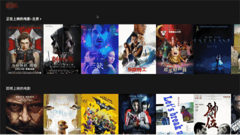
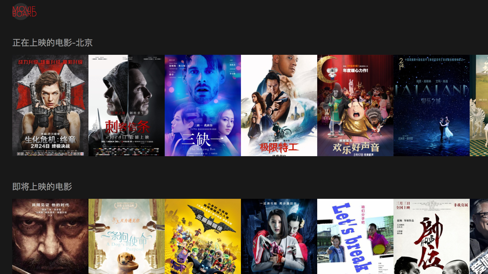
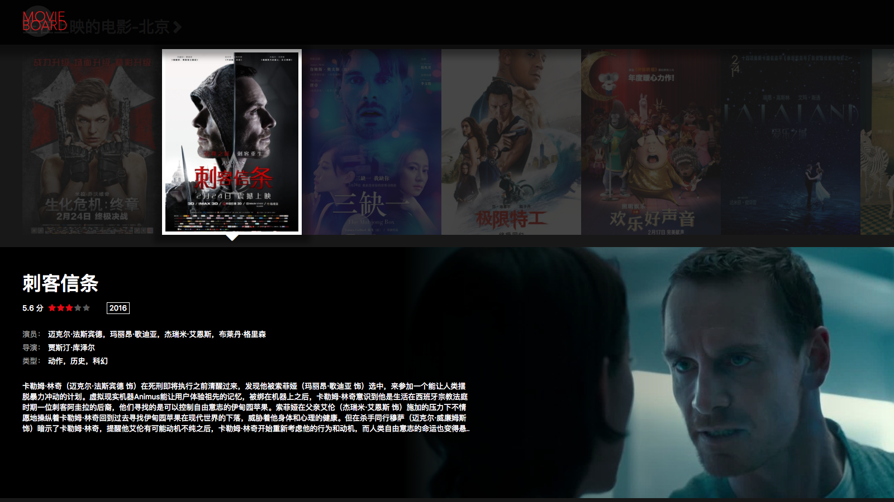

# movie-board
Re-design and implement Douban Movie using React and Redux.
There's no 3rd party UI libraries used in this project.
All components are designed and implemented only for this project.

## Online Demo @ Daocloud
http://henryli-movie-board.daoapp.io/
> Since it's running on a free Docker host, I just can't guarantee it would be always working.

## Screenshots







## Major Packages Used in this project

* ESLint
* Babel
* Webpack
* React including recompose, react-router
* Redux including redux-actions, redux-promise
* Immutable
* jQuery
* LESS
* Octicons (Github Icons)
* Others including classnames, normalize.css

## Project Plan / Roadmap
https://github.com/MagicCube/movie-board/projects/1

## How to Install
Clone the repo to your local storage, and install the dependencies using NPM
``` shell
git clone https://github.com/MagicCube/movie-board.git
npm install
```

## How to Build and Run
* Run in **Webpack DevServer**.
``` shell
npm run dev
```

* Or build it in **production mode**.
``` shell
npm run build
```

  Then run
``` shell
npm start
```

## Distribution Branch
Dist: https://github.com/magiccube/movie-board/tree/dist
